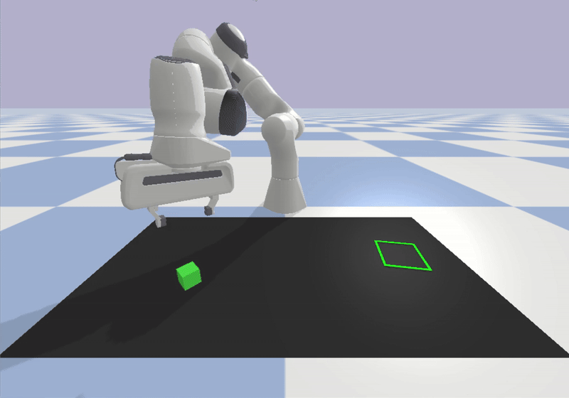

# A Pybullet Gym environment for a Pick-and-Place task with a Franka Panda robot

## This environment introduces a new manipulation task and a new robot model compared to the original block_pushing environment from the Diffusion Policy paper.

