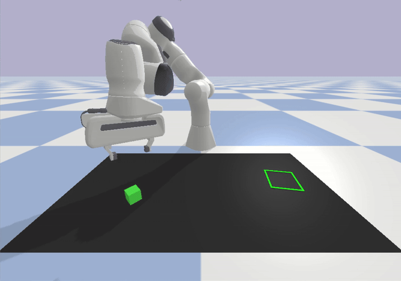

# A Pybullet Gym environment for a Pick-and-Place task with a Franka Panda robot
## This environment introduces a new manipulation task and a new robot model compared to the original block_pushing environment from the Diffusion Policy paper.
While the core environment structure (simulation loop, basic PyBullet setup) was inspired by the original implementation, all task-specific logic, robot configuration, and control routines have been developed independently for this project.

